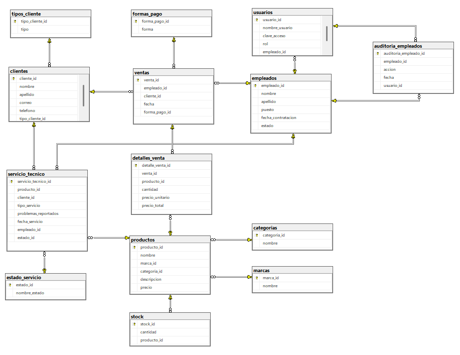

# ITIN_PC - Sistema de Ventas y Servicio Técnico

ITIN_PC es una aplicación de escritorio desarrollada en Java que permite gestionar las operaciones de una tienda de tecnología, incluyendo ventas de productos, control de stock, registro de clientes, empleados y manejo de órdenes de servicio técnico. Utiliza SQL Server como motor de base de datos y emplea JDBC para la conexión.

## Características Principales
- Autenticacion de usuarios
- Gestión de empleados
- Gestion de productos
- Gestion de clientes
- Gestion de ventas
- Gestion del servicio técnico

## Instalación

#### Clona este repositorio:
```bash
git clone https://github.com/Jilmar01/ITIN_PC-Sistema-de-Ventas-y-Servicio-Tecnico.git
```

## Configuración de la Conexión a SQL Server (JDBC)

Para establecer la conexión entre la aplicación y la base de datos SQL Server, se debe configurar el acceso a través del driver JDBC correspondiente. A continuación se detallan los parámetros necesarios que deben incluirse en el archivo de configuración ubicado en la siguiente ruta:

```
src\main\resources\dbconfig.properties
```

### Contenido del archivo `dbconfig.properties`

```properties
# Tipo de base de datos
db.type = sqlserver

# URL de conexión con cifrado habilitado y sin validación estricta del certificado
db.url = jdbc:sqlserver://localhost:1433;databaseName=ITIN_PC;encrypt=true;trustServerCertificate=true;

# Credenciales de autenticación
db.user = tu_usuario
db.password = tu_contraseña

# Clase del driver JDBC para SQL Server
db.driver = com.microsoft.sqlserver.jdbc.SQLServerDriver
```

## Modelos

### Modelo Relacional de la Base de Datos

La siguiente imagen muestra el modelo relacional del sistema ITIN_PC, donde se representan las principales entidades como clientes, empleados, productos, ventas, servicios técnicos y sus relaciones.



### SQL de Respaldo

- El archivo `sql/script_esquemas.sql` contiene la definición estructural de la base de datos, incluyendo la creación de todas las tablas, claves primarias, foráneas y relaciones necesarias para el correcto funcionamiento del sistema.

- El archivo `sql/script_automatizacion.sql` contiene la lógica automatizada de la base de datos, incluyendo triggers, procedimientos y funciones para tareas como auditoría, control de stock y generación de reportes. Cada acción debe ejecutarse individualmente una vez creado el esquema base.

- El archivo `sql/script_datos.sql` proporciona los datos de prueba necesarios para poblar la base de datos. Permite realizar pruebas funcionales del sistema y validar su comportamiento.

## Controladores

### Autenticacion
#### Autenticación de Usuarios

Un usuario puede iniciar sesión con su nombre de usuario y contraseña, obteniendo permisos de acuerdo con su rol dentro del sistema. Los roles disponibles son:

- ADMIN
- VENDEDOR
- TÉCNICO

Ejemplo de autenticación:

```java
AutenticacionControlador ac = new AutenticacionControlador();

// Logueado como administrador
boolean admin = ac.loginItinPC("admin_usuario", "admin123");

// Logueado como vendedor
boolean vendedor = ac.loginItinPC("vendedor_usuario", "vendedor123");
```

### Empleados
#### Registro de nuevo empleado y generación de usuario

Para registrar un nuevo empleado y generar automáticamente un usuario con su respectivo rol, ees necesario que el usuario haya iniciado sesión como Administrador (ADMIN).

1. Crear instancias de los controladores necesarios para empleados y usuarios.
2. Recibir el objeto `Empleado` desde la vista con los datos correspondientes.
3. Registrar el empleado y obtener su ID generado.
4. Generar un nombre de usuario y una contraseña basados en el nombre, apellido y rol del empleado.
5. Asociar el ID del empleado al usuario generado.
6. Registrar el nuevo usuario en el sistema y obtiene su ID generado.

Ejemplo de implementación:

```java
EmpleadoControlador ec = new EmpleadoControlador();
UsuarioControlador uc = new UsuarioControlador();

Empleado empleado = new Empleado("Ivan", "Sein", "Técnico de iPhone", new Date());

int empleadoId = -1;

String rol = "Tecnico";

try {
    empleadoId = ec.agregarEmpleado(empleado);

    Usuario usuario = uc.generarNombreUsuario(empleado.getNombre(), empleado.getApellido(), rol);

    usuario.setEmpleadoId(empleadoId);

    int usuarioId = uc.agregarUsuario(usuario);

    System.out.println("Empleado y usuario registrados con éxito. ID empleado: " + empleadoId + ", ID usuario: " + usuarioId);

} catch (Excepciones e) {
    System.out.println("Error al registrar empleado y usuario: " + e.getMessage());
}
```

#### Dar de baja un empleado

Para dar de baja a un empleado, es necesario que el usuario haya iniciado sesión como Administrador (ADMIN).

Desde la interfaz, se debe crear una instancia del controlador de empleados.

Se requiere el ID del empleado y la razón de la baja (por ejemplo: Despido o Renuncia)

Esto dara de baja a un empleado y registrara su respectiva auditoria.

Ejemplo de implementación:

```java
EmpleadoControlador ec = new EmpleadoControlador();

int empleadoId = 3;

try {
    boolean eliminado = ec.eliminarEmpleado(empleadoId, "Despido");
    if (eliminado) {
        System.out.println("Empleado eliminado correctamente.");
    }
} catch (Excepciones e) {
    System.out.println("Error al eliminar empleado: " + e.getMessage());
}
```

#### Reporte de empleados con número de ventas

Para ver el numero de ventas por empleado, es necesario que el usuario haya iniciado sesión como Administrador (ADMIN).

El sistema permite generar un reporte que muestra a cada empleado junto con la cantidad total de ventas realizadas. Esta funcionalidad es útil para análisis de desempeño y evaluación del personal de ventas.

Pasos del proceso:

1. Crear una instancia del controlador de empleados.
2. Llamar al método `empleadosConMasVentas()`, que retorna una lista de objetos `ReporteEmpleados`.
3. Recorrer la lista para mostrar el nombre del empleado y su número de ventas.

Ejemplo de implementación:

```java
EmpleadoControlador ec = new EmpleadoControlador();

try {
    // Obtener lista de empleados con sus ventas
    List<ReporteEmpleados> listaEmpleados = ec.empleadosConMasVentas();

    // Mostrar nombre y número de ventas de cada empleado
    for (ReporteEmpleados lE : listaEmpleados) {
        System.out.println(lE.getNombre() + " - Ventas: " + lE.getNumeroVentas());
    }
} catch (Excepciones e) {
    System.out.println("Error al generar reporte de empleados: " + e.getMessage());
}
```

### Productos
#### Registro de nuevo producto

Para agregar un nuevo producto al sistema, se deben especificar la categoría, la marca, la información del producto y la cantidad inicial en stock. El proceso es el siguiente:

1. Obtener el `ID` de la categoría y el `ID` de la marca desde la vista.
2. Crear una instancia del objeto `Producto` con su nombre, descripción, precio, marca y categoría.
3. Indicar la cantidad de productos a registrar.
4. Usar el controlador correspondiente para agregar el producto y su stock.

Ejemplo de implementación:

```java
ProductoControlador pc = new ProductoControlador();

int categoria_id = 1;
int marca_id = 4;

Producto producto = new Producto(
    "Laptop Asus Tuff",
    "Portátil Intel Core i5, 12GB RAM",
    899.99,
    marca_id,
    categoria_id
);

int cantidadProducto = 10;
int producto_id;

try {
    producto_id = pc.agregarProducto(producto, cantidadProducto);
    System.out.println("Producto agregado con éxito");
} catch (Excepciones ex) {
    System.out.println("Error al agregar producto: " + ex.getMessage());
}
```

#### Actualización de producto

Para actualizar la información de un producto existente, se debe recuperar o crear un objeto `Producto` con el ID del producto a modificar y establecer los nuevos datos que se desean actualizar. A continuación, se utiliza el controlador para aplicar los cambios en la base de datos.

Pasos del proceso:

1. Crear una instancia del controlador de productos.
2. Crear un objeto `Producto` con los datos actuales, incluyendo su `ID`.
3. Modificar los campos que se desean actualizar (por ejemplo, descripción, precio, etc.).
4. Llamar al método `actualizarProducto()` del controlador.

Ejemplo de implementación:

```java
ProductoControlador pc = new ProductoControlador();

// Producto original (ID 12)
Producto producto = new Producto(
    12,
    "Laptop Asus VivoBook",
    "Portátil Intel Core i5, 8GB RAM",
    899.99,
    4, // ID marca
    1  // ID categoría
);

// Datos a actualizar
String detalles = "Portátil Intel Core i3, 12GB RAM";
producto.setDescripcion(detalles);

boolean actualizado;

try {
    actualizado = pc.actualizarProducto(producto);
    if (actualizado) {
        System.out.println("Producto actualizado");
    }
} catch (Excepciones e) {
    System.out.println("Error al actualizar producto: " + e.getMessage());
}
```

#### Eliminación de producto

Para eliminar un producto del sistema, se debe contar con el `ID` del producto previamente registrado en la base de datos. Luego, se utiliza el controlador correspondiente para ejecutar la operación de eliminación.

Pasos del proceso:

1. Crear una instancia del controlador de productos.
2. Obtener el ID del producto que se desea eliminar desde la vista.
3. Llamar al método `eliminarProducto()` del controlador con el ID como argumento.

Ejemplo de implementación:

```java
ProductoControlador pc = new ProductoControlador();

// ID del producto a eliminar obtenido desde la vista
int producto_id = 12;

try {
    boolean eliminado = pc.eliminarProducto(producto_id);
    if (eliminado) {
        System.out.println("Producto eliminado");
    }
} catch (Excepciones e) {
    System.out.println("Error al eliminar producto: " + e.getMessage());
}
```

#### Búsqueda de productos por categoría

El sistema permite obtener un listado de productos filtrados por categoría. Para ello, se debe especificar el nombre de la categoría como argumento desde la vista y se utilizará el controlador de productos para recuperar los registros correspondientes.

Pasos del proceso:

1. Crear una instancia del controlador de productos.
2. Invocar el método `obtenerProductosPorCategoria()` pasando el nombre de la categoría.
3. Recorrer la lista resultante para mostrar los productos encontrados.

Ejemplo de implementación:

```java
ProductoControlador pc = new ProductoControlador();

// Nombre de la categoría obtenida desde la vista
String categoria = "mouse";
List<Producto> productos = new ArrayList<>();

try {
    productos = pc.obtenerProductosPorCategoria(categoria);
} catch (Excepciones e) {
    System.out.println("Error al buscar productos por categoría: " + e.getMessage());
}

for (Producto producto : productos) {
    System.out.println(producto.getNombre());
}
```

### Clientes
#### Consulta de clientes VIP por mes y año

El sistema permite obtener una lista de clientes VIP que realizaron compras en un mes y año específicos. Esta funcionalidad facilita el análisis de fidelización y comportamiento de clientes destacados durante un periodo determinado.

Pasos del proceso:

1. Obtener desde la vista los valores del mes y el año que se desean consultar.
2. Crear una instancia del controlador de clientes.
3. Llamar al método `obtenerClientesVIP(mes, anio)`, que retorna una lista de objetos `Cliente`.
4. Recorrer la lista para mostrar los clientes encontrados.

Ejemplo de implementación:

```java
ClienteControlador cc = new ClienteControlador();

// Datos obtenidos desde la vista
int mes = 8;
int anio = 2025;

try {
    List<Cliente> clientes = cc.obtenerClientesVIP(mes, anio);

    for (Cliente c : clientes) {
        System.out.println(c.getNombre());
    }

} catch (Excepciones e) {
    System.out.println("Error al obtener clientes VIP: " + e.getMessage());
}
```

### Ventas
#### Registro de una venta

El sistema permite registrar una venta asociada a un cliente, especificando los productos adquiridos, la forma de pago y el empleado que la realiza. Esta operación actualiza el historial de ventas y el stock disponible.

Pasos del proceso:

1. Obtener desde la vista los IDs del cliente, empleado y forma de pago.
2. Crear los objetos `DetalleVenta` con los productos seleccionados, indicando su ID, cantidad y precio unitario.
3. Agregar los detalles a una lista de tipo `List<DetalleVenta>`.
4. Instanciar un objeto `Venta` y establecer sus atributos principales.
5. Llamar al método `registrarVenta(Venta venta, List<DetalleVenta> detalles)` desde el controlador correspondiente.
6. Verificar si la operación fue exitosa a través del valor de retorno.

Ejemplo de implementación:

```java
VentaControlador vc = new VentaControlador();

// Crear los detalles de la venta - argumentos obtenidos desde la vista
DetalleVenta d1 = new DetalleVenta(9, 1, 730.00);      // 1 unidad del producto con ID 9
DetalleVenta d2 = new DetalleVenta(11, 1, 899.99);     // 1 unidad del producto con ID 11
DetalleVenta d3 = new DetalleVenta(12, 2, 899.99);     // 2 unidades del producto con ID 12

// Lista de los detalles de venta
List<DetalleVenta> listaDetalles = new ArrayList<>();
listaDetalles.add(d1);
listaDetalles.add(d2);
listaDetalles.add(d3);

//Argumentos obtenidos desde la vista
int clienteId = 2;
int formaPagoId = 1;

// Crear la venta (empleado_id, cliente_id, forma_pago_id)
Venta venta = new Venta();
venta.setEmpleadoId(2);
venta.setClienteId(clienteId);
venta.setFormaPagoId(formaPagoId);

// Registrar la venta
int registrada = vc.registrarVenta(venta, listaDetalles);

if (registrada > 0) {
    System.out.println("Venta registrada con éxito.");
} else {
    System.out.println("Error al registrar la venta.");
}
```

### Servicio Técnico
#### Reporte de servicios técnicos por marca

El sistema permite generar un reporte de los servicios técnicos realizados, filtrado por la marca del producto. Esta funcionalidad es útil para analizar la demanda de soporte técnico asociada a marcas específicas, y detectar posibles patrones de fallos frecuentes.

Pasos del proceso:

1. Obtener desde la vista el nombre de la marca a consultar.
2. Crear una instancia del controlador de servicios técnicos.
3. Llamar al método `obtenerReportesPorMarca(String marca)`, pasando el nombre de la marca como argumento.
4. Recorrer la lista de objetos `ReporteServicioTecnico` para mostrar los resultados.

Ejemplo de implementación:

```java
ServicioTecnicoControlador sc = new ServicioTecnicoControlador();

// Marca del producto obtenida desde la vista
String marca = "Asus";

// Obtener reporte de servicios técnicos por marca
List<ReporteServicioTecnico> r = sc.obtenerReportesPorMarca(marca);

// Mostrar tipo de servicio y marca del producto
for (ReporteServicioTecnico re : r) {
    System.out.println(re.getTipoServicio() + " - " + re.getMarcaProducto());
}
```
